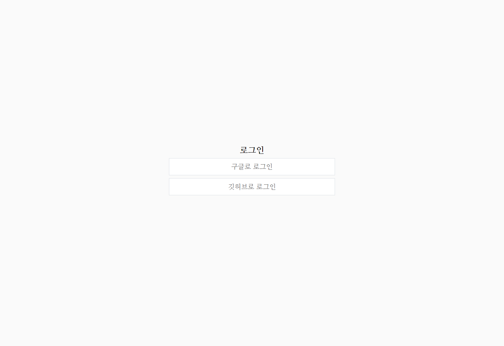
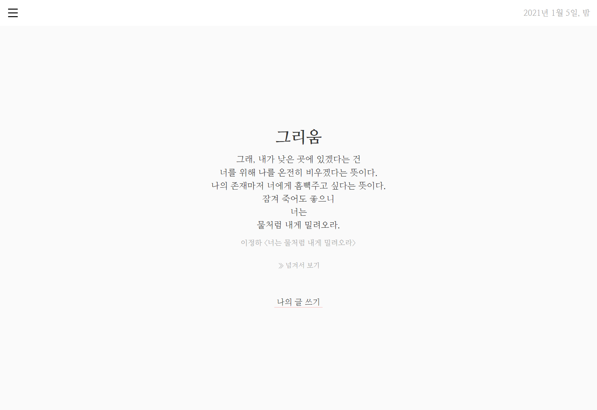
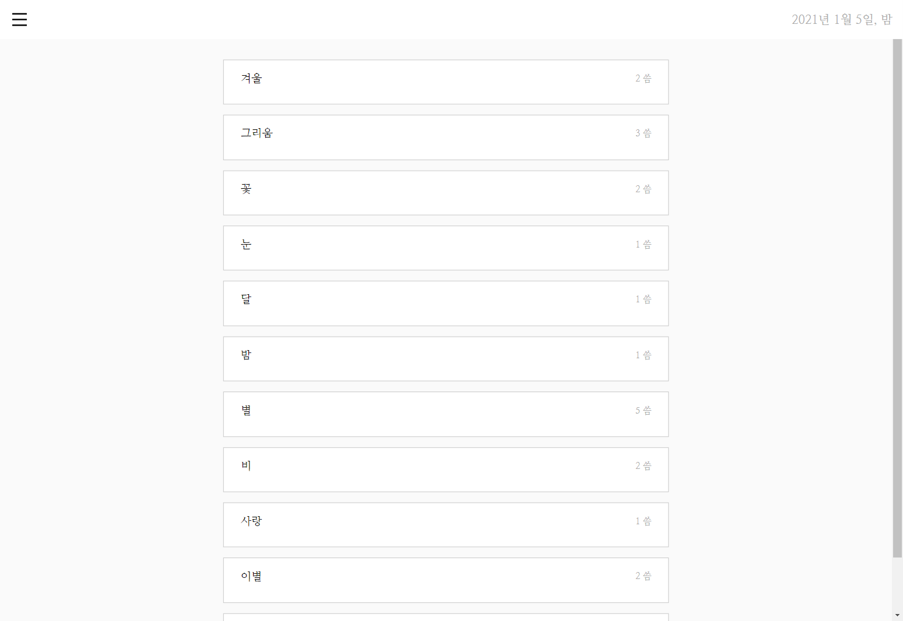
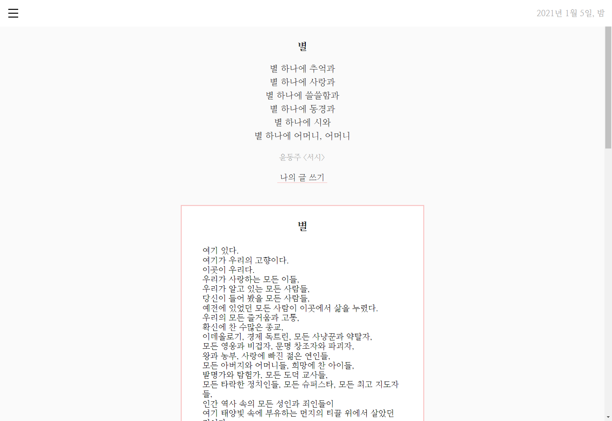
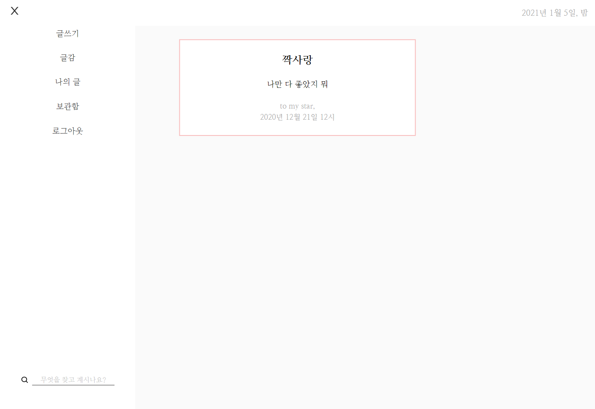

## Project

- [씀](https://apps.apple.com/kr/app/%EC%94%80-%EC%9D%BC%EC%83%81%EC%A0%81-%EA%B8%80%EC%93%B0%EA%B8%B0/id1118780107) 이라는 글을 작성하고 공유할 수 있는 어플리케이션의 어플리케이션의 주요 기능을 웹으로 구현한 프로젝트 입니다.
- 다음과 같은 주요 기능을 구현하였습니다

  - 로그인, 로그아웃 및 유저의 상태에 따라 컴포넌트 접근을 제한하는 Authentification Check 구현
  - 유저가 사용할 수 있는 여러 기능을 Side bar 메뉴 방식으로 제공
  - 글감을 검색해서 해당 글감과 관련된 글을 볼 수 있는 기능
  - 글감을 선택해서 글을 작성, 수정, 삭제할 수 있는 기능
  - 다른 사람이 쓴 글을 담아가거나 삭제할 수 있는 기능

- github page를 사용해서 배포하였습니다.
- [https://ibtg.github.io/react-firebase-write-app/writing](https://ibtg.github.io/react-firebase-write-app/writing)

---

## 화면

|            로그인            |             홈              |
| :--------------------------: | :-------------------------: |
|  |  |

|            글쓰기             |              글감              |
| :---------------------------: | :----------------------------: |
|  |  |

|               글               |             보관함             |
| :----------------------------: | :----------------------------: |
|  |  |

---

## Browsers support

- 다음과 같은 웹 브라우저 환경에서 동작합니다.

| Chrome | Microsoft Edge | Firefox | Naver Whale |
| :----: | :------------: | :-----: | :---------: |
|  87.0  |      87.0      |  83.0   |     2.8     |

---

## Backend

### Skill Stack

- Firebase

### Folder Structure

```
├─ service
├─── auth_service
├─── firebase
├─── writing_repository

```

- firebase

  - Firebase에 유저 정보를 초기화 합니다.

- auth_service

  - user의 상태 확인 및 로그인, 로그아웃과 관련된 함수가 정의되어 있습니다.

- writing_repository

  - 글과 글감을 처리하기 위한 함수가 정의되어 있는 클래스 입니다.

  - getSubjects

    - Database에 저장된 글감 목록을 가져오는 함수

  - getWriting

    - Database에서 랜덤으로 저장된 글을 가져오는 함수

  - saveWriting

    - 유저가 작성, 수정한 글을 Database에 저장

  - getMyWriting

    - 유저가 작성한 글을 Database에서 가져오는 함수

  - getSearch

    - 글감을 검색해 Database에서 검색 결과를 찾아서 보여주는 함수

  - getFavorite

    - 담아가기 기능으로 추가한 다른 사람의 글을 DataBase에서 가져오는 함수

  - addToFavorite

    - 다른 사람의 글을 Database에 저장

  - removeToFavorite

    - 내가 담아간 다른 사람의 글을 DataBase에서 삭제

---

## Client

### Skill Stacks

- React.js
- PostCSS

### Folder Structure

```
├─ src
├─── components
├─── hoc

```

- favrite, favoritePage

  - 내가 담아온 글들을 보여줍니다.
  - 내가 담아온 글을 삭제할 수 있습니다.

- header, sidebar

  - 유저가 사용할 수 있는 여러 기능을 Side bar 메뉴 방식으로 제공
  - Side bar에서 글감을 검색할 수 있습니다.

- login

  - login과 관련된 화면이 정의되어 있습니다.

- myWriting

  - 내가 작성한 글을 볼 수 있습니다.

- myWritingPage

  - 내가 작성한 글을 수정, 삭제할 수 있습니다.

- search

  - 검색 결과를 보여주는 화면입니다.

- subjects, subject

  - 글감을 보여주는 화면을 담당합니다.

- writePage

  - 글감에 대한 글을 작성할 수 있습니다.

- writing

  - 메인 화면에서 새로운 글감을 제공합니다.
  - 새로운 글감에 대해 글을 작성할 수 있습니다.

- writingList

  - favorite, mywriting, search 컴포넌트에서 글을 보여주기 위해 사용하는 자식 컴포넌트입니다.

- writingPage

  - 다른 사람이 작성한 글을 담아갈 수 있는 화면입니다.

- hoc (Higer-Order Component)

  - Authentificaton check를 위한 auth.js가 정의 되어 있는 폴더

  - 로그인 하지 않은 사용자가 로그인한 사용자만 접속할 수 있는 페이지에 접근하려고 할 때 이를 막고 로그인 페이지로 이동합니다.
